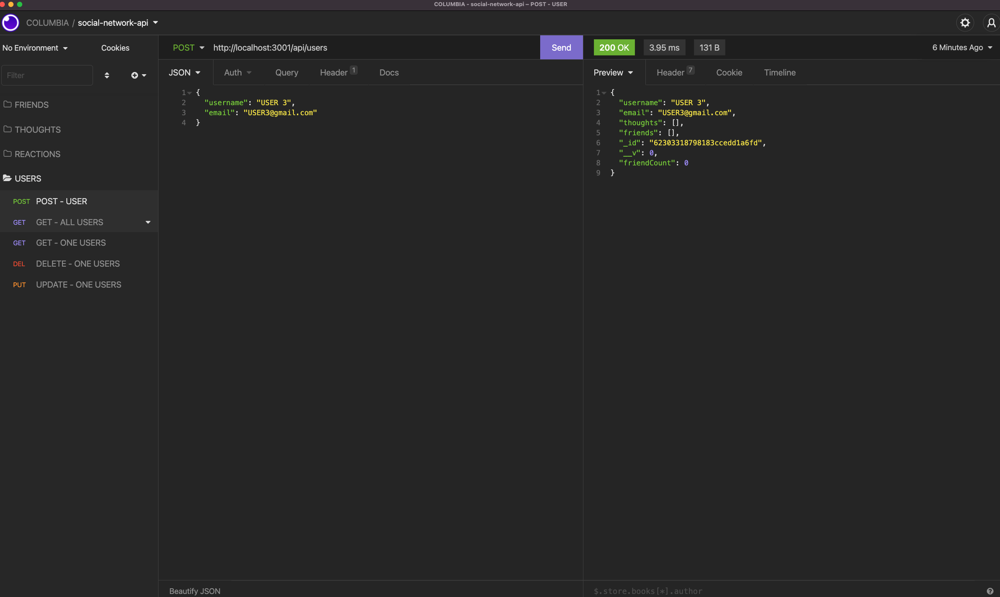
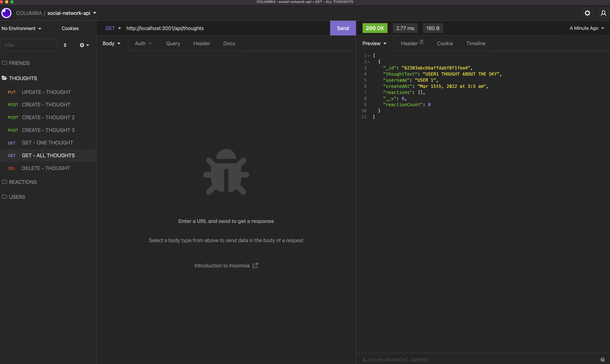
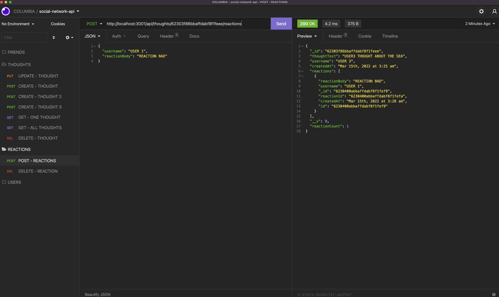

# E-commerce-back-end

## Links
- REPO: https://github.com/alvaroormeno/E-commerce-back-end

## Description
An API for a social network web application where users can share their thoughts, react to friends’ thoughts, and create a friend list. 

## Usage
- Download repo
- Install Modules - npm i
- Start App

## Videos

### USERS - CREATE, GET ALL, GET ONE, DELETE, UPDATE 
- VIDEO LINK: https://drive.google.com/file/d/1bQDQtpWgX97trRpNWPn_EtIk3skU1UFM/view



### THOUGHTS - CREATE, GET ALL, GET ONE, DELETE, UPDATE 
- VIDEO LINK: https://drive.google.com/file/d/17XyG3u_bRTFZ5B7ku9FHbuWTCnwAOJHJ/view



### REACTIONS - CREATE and DELETE
- VIDEO LINK: https://drive.google.com/file/d/1tyZ7LcW2Tc1fy3q3-wCw3tLMHrl4_h6y/view



### FRIENDS - ADD and DELETE
- VIDEO LINK: https://drive.google.com/file/d/1dlIeg1-tkeZ-NQJb4vbnmwATSaFI4jB7/view


## User Story
```
AS A social media startup
I WANT an API for my social network that uses a NoSQL database
SO THAT my website can handle large amounts of unstructured data
```

## Acceptance Criteria
```
GIVEN a social network API
WHEN I enter the command to invoke the application
THEN my server is started and the Mongoose models are synced to the MongoDB database
WHEN I open API GET routes in Insomnia for users and thoughts
THEN the data for each of these routes is displayed in a formatted JSON
WHEN I test API POST, PUT, and DELETE routes in Insomnia
THEN I am able to successfully create, update, and delete users and thoughts in my database
WHEN I test API POST and DELETE routes in Insomnia
THEN I am able to successfully create and delete reactions to thoughts and add and remove friends to a user’s friend list

```
## Built With

- JavaScript
- Node.js
- Express.js
- Mongo DB
- Mongoose